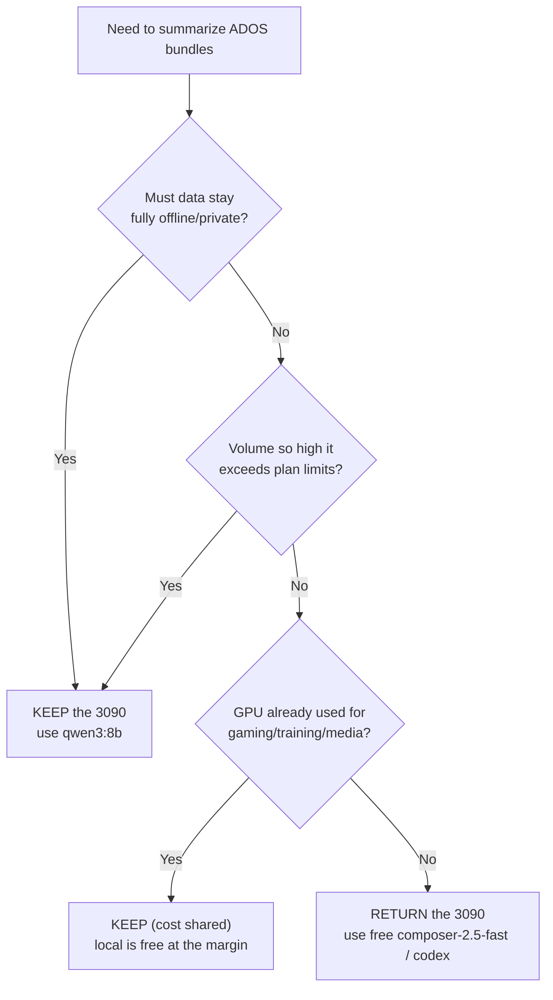

# AI Model Tests — Is the RTX 3090 24 GB worth $1,400 for this workload?

**Verdict (one line):** For ADOS structured-extraction summarization, the **free,
plan-covered cloud models beat every model the RTX 3090 can run** — so the
**$1,400 card is not justified by output quality alone**; keep it only for
privacy/offline, very high volume, or if it is already amortized by other GPU work.

| | |
|---|---|
| **Date** | 2026-06-25 |
| **Hardware under test** | NVIDIA GeForce RTX 3090, 24 GB (≈$1,400 used) |
| **Host** | WSL2 (Ubuntu) + Ollama; Cursor / ChatGPT via signed-in plan |
| **Task** | Classify + summarize project bundles into the ADOS ontology (`gpt summarize`) |
| **Sample** | First 10 clusters from `clusters.json` (identical bundles for every model) |
| **Context window** | `--num-ctx 16384` (held constant) |
| **Models** | 12 local Ollama generation models (GPU) + 1 CPU build + 2 free Cursor models, with `codex` as a cloud reference |
| **Raw data** | `$DATA_ROOT/runs/cmp-*/`, `benchmark_combined.json`, `benchmark_results.log`, `benchmark_cursor.log` |

---

## Contents

1. [Goal and central question](#1-goal-and-central-question)
2. [Executive verdict](#2-executive-verdict)
3. [Methodology](#3-methodology)
4. [Results](#4-results)
5. [Findings](#5-findings)
6. [Economic analysis — the $1,400 question](#6-economic-analysis--the-1400-question)
7. [Recommendation](#7-recommendation)
8. [Open questions](#8-open-questions)
9. [Next steps](#9-next-steps)
10. [Reproducibility](#10-reproducibility)
11. [Appendix](#11-appendix)

---

## 1. Goal and central question

A used **RTX 3090 (24 GB)** was purchased for ~**$1,400**. The card can still be
returned for a refund, so this test exists to answer one decision:

> **Does running the ADOS summarizer locally on the RTX 3090 produce results good
> enough to justify $1,400, versus the free cloud models already included in a
> Cursor / ChatGPT plan?**

Concretely the test must establish, on the *same* work:

- **Quality** — how completely and deeply each model fills the structured ADOS
  record (goal, objectives, requirements, archetype fields).
- **Speed** — real per-item latency on this GPU.
- **Reliability** — how often a model actually finishes an item versus failing.
- **Cost** — marginal cost per item, and how the $1,400 capital outlay compares to
  a $0-marginal plan that the user already pays for.

Everything below is framed against the keep-vs-return decision.

## 2. Executive verdict

**The $1,400 RTX 3090 is hard to justify for this workload.** The two free
first-party Cursor models (`composer-2.5`, `composer-2.5-fast`) scored **100% ADOS
record depth at 100% completion** — matching the `codex` reference — while the
**best local model (`qwen3:8b`) reached only 74% depth at 80% completion**. No
local model came close on quality or reliability, and all of them are slower or
equal to `composer-2.5-fast` once you account for the items they silently drop.

Because those cloud models are **$0 marginal on a plan the user already has**, the
GPU's local inference does not buy better results — it only adds a $1,400 capital
cost. The card is worth keeping **only if at least one** of these holds:

1. **Privacy / offline is non-negotiable** — transcripts must never leave the machine.
2. **Volume × rate-limits** — throughput needs exceed what the plan comfortably serves.
3. **Already amortized** — the GPU is also used for gaming / training / image-video
   generation, so local LLM inference is "free" at the margin (just electricity).

If none apply, **returning the card loses little for this purpose.** If kept,
standardize on **`qwen3:8b`** (best local quality) or **`qwen2.5-coder:1.5b`**
(best speed-per-quality).

## 3. Methodology

### 3.1 Test design (apples-to-apples)

The deterministic build (**Extract → Cluster → Bundle**) has no LLM and is
provider-independent, so it was built **once** and every model was pointed at the
**same bundles**:

- `gpt summarize --limit 10` selects the **first 10 qualifying clusters** from
  `clusters.json` — same filter, same on-disk order — so the slug set is identical
  for every model.
- Each model ran under its **own `--run-label`** (`cmp-*`), writing an isolated
  output + timing trace under `$DATA_ROOT/runs/<label>/`. No run overwrote another.
- `--num-ctx 16384` and the bundle set were held constant; only the model varied.

The 10-slug sample deliberately includes the **235 KB `ados-profile` mega-bundle**
as item 1, so every model's reliability is tested on the single hardest input.

### 3.2 Models under test

12 unique local generation models on the GPU (all installed Ollama generation tags,
embeddings excluded), plus the CPU-only build of `qwen2.5-coder:3b`, plus the two
free Cursor models, plus `codex` as a cloud reference. Two installed tags are
byte-identical duplicates and were tested once:

| Tag | Equivalent to |
|---|---|
| `qwen2.5-coder:latest` | `qwen2.5-coder:7b` (same blob id) |
| `qwen3.6:27b-q4_K_M` | `qwen3.6:27b` (same blob id) |

### 3.3 Metric definitions

- **`s/item` (speed, rank key)** = wall-clock seconds ÷ completed item, averaged
  over successful (`LLM_OK`) items. This is the real latency you wait for a result,
  so faster sorts higher.
- **`gen tok/s`** = output tokens ÷ wall-seconds (pure generation rate).
- **total `tok/s`** = (input+output) tokens ÷ wall-seconds. **Not** used for ranking:
  it is inflated by how fast a model *ingests* big input bundles, so a model can
  look fast while still finishing each item slower.
- **ADOS quality %** = mean of four 0–100 axes — goal presence, objective-set
  depth, requirement-set depth, archetype-field fill — over completed items.
  Objectives and requirements are **graded by depth** (count capped at 3, where
  3 objectives map to the forming/speeding/governance triad), so one thin objective
  no longer scores like a full, governed set. It is a **completeness/depth proxy,
  not human-judged correctness** (correctness is adjudicated separately against the
  source bundle — see the README worked example).
- **Completion** = `LLM_OK / attempted`. A failed item is still written with the
  deterministic prior and empty prose, so it *looks* classified — completion is the
  honest reliability signal.

### 3.4 Environment and controls

- WSL2 + Ollama on the RTX 3090 (24.6 GB usable); Cursor via the `cursor-agent` CLI
  on a signed-in paid plan; `codex` via the ChatGPT plan.
- Runs were driven by a controlled script with a **per-model timeout** so a model
  that spilled to CPU or hung could not stall the suite.

**Fixes applied mid-test (result integrity).** Three real problems surfaced while
running weak/headless models and were fixed so they did not corrupt the results:

| Problem | Fix |
|---|---|
| Weak models (e.g. `gemma3:1b`) emit a bare string where the schema expects an object (`"primary_archetype": "software_app"`), crashing the whole run with `AttributeError` | `build_item` now coerces malformed fields to the deterministic prior (`_as_obj`/`_as_list`/`_as_text`); regression tests added |
| `cursor-agent` blocked on an interactive "trust this directory?" prompt and failed every item | Cursor provider now passes `--trust` (headless) |
| `qwen2.5-coder:3b-cpu` (CPU build) ran ~5.5 min on the first item | Killed and marked `skip` in the model bank (too slow to be usable) |

## 4. Results

### 4.1 Master table (sorted by quality, then speed)

| Model | Where it ran | Quality % | s/item | gen tok/s | Completed | Marginal $ |
|---|---|---:|---:|---:|---:|---|
| **composer-2.5-fast** | Cursor (free, cloud) | **100** | 16.9 | 67.1 | **10/10** | $0 (plan) |
| **composer-2.5** | Cursor (free, cloud) | **100** | 42.9 | 26.2 | **10/10** | $0 (plan) |
| _codex (reference)_ | ChatGPT (free, cloud) | _100_ | _26.1_ | _40.9_ | _184/184_ | _$0 (plan)_ |
| qwen3:8b | RTX 3090 | 74 | 9.8 | 49.8 | 8/10 | $0 local |
| qwen2.5-coder:1.5b | RTX 3090 | 65 | **4.3** | **123.1** | 8/10 | $0 local |
| qwen2.5-coder:14b | RTX 3090 | 59 | 14.4 | 29.2 | 8/10 | $0 local |
| gpt-oss:20b | RTX 3090 | 58 | 16.8 | 26.0 | 7/10 | $0 local |
| qwen2.5vl:7b | RTX 3090 | 56 | 7.3 | 60.7 | 8/10 | $0 local |
| qwen3.6:27b | RTX 3090 | 54 | 25.9 | 24.0 | 6/10 | $0 local |
| qwen2.5-coder:7b | RTX 3090 | 53 | 7.1 | 56.5 | 8/10 | $0 local |
| qwen3.6:35b | RTX 3090 ¹ | 50 | 9.8 | 57.4 | 6/10 | $0 local |
| llama3.1:8b | RTX 3090 | 46 | 7.8 | 46.6 | 8/10 | $0 local |
| gemma4:31b | RTX 3090 | 45 | 31.1 | 19.1 | 5/10 | $0 local |
| qwen2.5-coder:3b | RTX 3090 | 44 | 4.5 | 78.9 | 8/10 | $0 local |
| gemma3:1b | RTX 3090 | 8 | 2.6 | 78.0 | 7/10 | $0 local |
| qwen2.5-coder:3b-cpu | CPU only | — | ~330 ² | — | killed | skipped |

¹ `qwen3.6:35b` loaded at **24.0 GB of the 24.6 GB** available — it fits only at the
very edge with a 16k context; a larger `--num-ctx` would OOM.
² The CPU build managed ~**5.5 min on the first item** before being killed
(~130× slower than the same weights on the GPU).

### 4.2 Quality breakdown (per ADOS axis, % over completed items)

| Model | Quality % | goal | obj | req | af |
|---|---:|---:|---:|---:|---:|
| composer-2.5 | 100 | 100 | 100 | 100 | 100 |
| composer-2.5-fast | 100 | 100 | 100 | 100 | 100 |
| qwen3:8b | 74 | 80 | 60 | 77 | 80 |
| qwen2.5-coder:1.5b | 65 | 80 | 47 | 60 | 75 |
| qwen2.5-coder:14b | 59 | 80 | 43 | 43 | 70 |
| gpt-oss:20b | 58 | 70 | 30 | 63 | 70 |
| qwen2.5vl:7b | 56 | 80 | 43 | 70 | 32 |
| qwen3.6:27b | 54 | 60 | 40 | 60 | 57 |
| qwen2.5-coder:7b | 53 | 80 | 47 | 30 | 54 |
| qwen3.6:35b | 50 | 60 | 33 | 50 | 57 |
| llama3.1:8b | 46 | 80 | 40 | 33 | 32 |
| gemma4:31b | 45 | 50 | 37 | 47 | 47 |
| qwen2.5-coder:3b | 44 | 80 | 43 | 3 | 50 |
| gemma3:1b | 8 | 20 | 13 | 0 | 0 |

`goal` = % items with a non-empty goal · `obj`/`req` = objective/requirement-set
depth (capped at 3) · `af` = archetype-field fill rate.

### 4.3 VRAM fit (does 24 GB constrain the choice?)

| Class | Models | Outcome on the 3090 |
|---|---|---|
| ≤ 14 GB | everything up to `qwen2.5-coder:14b` (8.4 GB) | Fits comfortably, fast |
| 17–20 GB | `gpt-oss:20b`, `qwen3.6:27b` | Fits |
| ~20 GB | `gemma4:31b` | Fits (100% GPU) |
| 23 GB | `qwen3.6:35b` | Fits only at the edge (24.0/24.6 GB at 16k ctx) |
| CPU | `qwen2.5-coder:3b-cpu` | Unusable (~5.5 min/item) |

**Every installed model ran on the GPU** — even the 23 GB one (barely). The only
hard failure was the CPU build. So 24 GB is *not* the binding constraint; the GPU's
value is simply *the ability to run local models at all*, not access to bigger ones.

## 5. Findings

1. **The free cloud models win outright.** Both Cursor free models and `codex`
   scored **100% depth at 100% completion**; the best local model (`qwen3:8b`)
   reached **74% depth at 80% completion**. Nothing local was competitive on
   quality or reliability.
2. **Bigger local ≠ better.** The 27B–35B models cost far more VRAM and time for
   *worse* output than the 8B `qwen3`. `gemma4:31b` was the worst large model
   (45% depth, **5/10** completed, 31 s/item). The sweet spot for this structured-
   JSON task is **7B–8B**, not the biggest model that fits.
3. **The GPU is mandatory for any local use, but 24 GB is not the limiter.**
   Every model ran; only the CPU build failed. The 3090 buys *local capability*,
   not bigger-is-better headroom.
4. **Local's real edge is raw speed at $0 marginal — when "good enough" is OK.**
   `qwen2.5-coder:1.5b` does **4.3 s/item at 123 gen tok/s** and still hits 65%
   depth: ideal for cheap, private, high-volume first passes. But it drops ~2 of 10
   hard bundles every time.
5. **Local reliability is the quiet tax.** Local models failed ~**20–50%** of items
   (the 235 KB `ados-profile` bundle plus others) and silently fall back to the
   deterministic prior; the cloud free models failed **0%**.

## 6. Economic analysis — the $1,400 question

### 6.1 Cost model

| Option | Up-front | Marginal / item | Quality | Reliability |
|---|---|---|---|---|
| **Cursor free (`composer-2.5-fast`)** | $0 (existing plan) | **$0** (plan pool) | 100% | 100% |
| **codex (ChatGPT plan)** | $0 (existing plan) | $0 (plan) | 100% | 100% |
| **RTX 3090 local (`qwen3:8b`)** | **$1,400** | ~$0.0002 electricity ¹ | 74% | 80% |
| Paid API (not tested here) | $0 | per-token (see README bank: ~$0.8–$7 / full run) | — | — |

¹ RTX 3090 ≈ 350 W peak; at ~10 s/item that is ≈ 0.001 kWh ≈ **$0.0002/item** at
$0.20/kWh — negligible next to the capital cost.

### 6.2 Why the GPU does not "break even" here

The honest comparison for *this* task is **$1,400 capital vs $0 marginal on a plan
the user already pays for**. Against a $0-marginal alternative that is *also higher
quality*, the GPU never pays back — it is pure added cost for this workload.

The only way the capital pencils out is against a **rented** cloud GPU (e.g.
~$0.30/GPU-hr for a 3090/4090-class instance):

```
$1,400 ÷ $0.30/hr ≈ 4,600 GPU-hours to break even
at ~8 s/item that is ≈ 2 million items before owning beats renting
```

So buying is rational only at **sustained, very high local volume** or for
**always-available private inference** — not for occasional ADOS runs.

### 6.3 Decision



## 7. Recommendation

- **If quality is the priority and a plan exists:** use **`composer-2.5-fast`**
  (100% depth, 100% completion, 16.9 s/item, $0) or `codex`. No local model matches them.
- **Keep-vs-return the 3090:** return it for this workload **unless** privacy,
  volume, or amortization (Section 2 / 6.3) applies.
- **If kept, standardize locally on:** `qwen3:8b` (best local quality, 74%) for
  quality-sensitive work, or `qwen2.5-coder:1.5b` (4.3 s/item, 65%) for fast,
  private bulk first passes. Avoid the 27B–35B models — slower, less reliable, no
  quality gain.

## 8. Open questions

These are the gaps that limit how strongly the verdict can be stated. Each has a
matching item in [Next steps](#9-next-steps).

1. **Small sample (n = 10), no variance.** Each model saw only 10 bundles and ran
   once, so the quality/speed numbers have no confidence interval. A 2–3 point
   quality gap between adjacent local models is inside the noise.
2. **Single domain / single user.** All bundles come from one person's June-2026
   ChatGPT export. Results may not generalize to other content mixes (more code,
   more prose, other languages).
3. **Quality % measures depth, not correctness.** It rewards a fully-filled ADOS
   record, but a model can fill every field *wrongly* and still score 100%.
   Correctness was only spot-checked (README worked example), not measured at scale.
4. **Electricity is estimated, not metered.** The ~$0.0002/item figure assumes
   350 W and $0.20/kWh; actual draw under sustained load was not logged.
5. **Paid frontier cloud models out of scope.** `gpt-5`, `gpt-5-mini`,
   `claude-sonnet-4`, etc. were not run, so the "cloud" column is only the *free*
   tier — the paid quality ceiling is unmeasured.
6. **`num_ctx` fixed at 16k.** Larger contexts (which the 3090 may or may not fit
   for big models) and larger `--max-chars` bundles were not swept; the 235 KB
   bundle was truncated identically for all.
7. **Cursor cost is a `chars/4` estimate.** The ~$0.47/10-items figure in the logs
   is an upper-bound text-length estimate, not real Cursor billing (it is $0 on the
   plan). Token-exact cloud cost was not captured.
8. **Single hardware point.** Only the 3090 was tested — no 4090 / cheaper GPU /
   rented-cloud-GPU comparison to anchor the capital break-even.
9. **Sustained-load behavior unknown.** Thermals, clock throttling, and throughput
   over a full multi-hundred-item run (vs the 10-item burst) were not characterized.
10. **Silent fallback on failure.** A failed item is written with the deterministic
    prior, so completion rate captures failures but the *downstream* impact of those
    fallbacks on a real catalog was not quantified.

## 9. Next steps

Ordered by how much they would sharpen the keep-vs-return decision.

1. **Scale and repeat the sample.** Re-run the top 3–4 candidates
   (`composer-2.5-fast`, `codex`, `qwen3:8b`, `qwen2.5-coder:1.5b`) at
   `--limit 50` (or all 181 bundles), 3× each, and report mean ± spread. This
   collapses the n=10 noise and confirms the local-vs-cloud gap is real.
2. **Measure correctness, not just depth.** Use `gpt compare` to surface
   archetype/domain disagreements against `codex`, adjudicate a 20–30 item sample
   against the source bundles, and report an accuracy % alongside the depth %.
3. **Meter real power and cost.** Log `nvidia-smi --query-gpu=power.draw` during a
   full run to compute true Wh/item and $/1,000 items, then express the $1,400 as a
   break-even in months against a rented cloud GPU at current market rates.
4. **Add the paid cloud baselines.** Run `gpt-5-mini` and `claude-haiku-4` (cheap)
   to map the quality/cost frontier above the free tier — this tells you whether
   *any* cloud spend beats the GPU, not just the free models.
5. **Sweep `num_ctx` and bundle size.** Test 8k / 16k / 32k and a larger
   `--max-chars` to see whether local big models improve with more context (and
   whether the 3090 still fits them).
6. **Broaden the corpus.** Repeat on a code-heavy and a prose-heavy export to test
   generalization beyond this single user's data.
7. **Characterize sustained load.** Run all 181 bundles locally and record
   throughput, temperature, and any thermal throttling to validate the "high
   volume" keep-condition.
8. **Add a second GPU data point** (or a rented instance) so the capital decision
   is anchored against at least one alternative price/perf point.

## 10. Reproducibility

All commands are read-only except `gpt summarize` (which writes only under its own
`--run-label`). `$DATA_ROOT` is the data root (here `~/chatgpt-reconstructor-data`).

```bash
# 0. Build once (deterministic, no LLM) — reused by every model run.
./gpt run --zip "$GPT_ZIP3"

# 1. Same 10 slugs, same context, isolated per model. One line per model:
SHARED="--limit 10 --noask --num-ctx 16384 \
  --store $DATA_ROOT/store --bundles $DATA_ROOT/bundles"

#   Local Ollama (provider auto-filled from the model bank):
./gpt summarize $SHARED --run-label cmp-qwen3-8b        --model qwen3:8b
./gpt summarize $SHARED --run-label cmp-qwen-coder-1_5b --model qwen2.5-coder:1.5b
./gpt summarize $SHARED --run-label cmp-qwen-coder-14b  --model qwen2.5-coder:14b
./gpt summarize $SHARED --run-label cmp-gptoss-20b      --model gpt-oss:20b
# …(one per installed model; see the model bank: `./gpt summarize --list-models`)…

#   Free cloud baselines:
./gpt summarize $SHARED --run-label cmp-cursor-fast --provider cursor --model composer-2.5-fast
./gpt summarize $SHARED --run-label cmp-cursor      --provider cursor --model composer-2.5

# 2. Read the numbers back, scoped to just these runs (read-only, runs nothing):
./gpt metrics perf    "$DATA_ROOT"/runs/cmp-*/summarize_trace.jsonl
./gpt metrics quality "$DATA_ROOT"/runs/cmp-*/reconstructed_projects.json
#   …or the combined leaderboard over everything present:
./gpt arena
```

**Artifacts (private; under `$DATA_ROOT`, gitignored):**

| Artifact | Path | Contents |
|---|---|---|
| Per-run output | `runs/cmp-<label>/reconstructed_projects.json` | What that model produced for the 10 slugs |
| Per-run trace | `runs/cmp-<label>/summarize_trace.jsonl` | Per-item seconds, in/out tokens, failures |
| Ollama driver log | `benchmark_results.log` | Per-model exit code, wall time, items/failed |
| Cursor driver log | `benchmark_cursor.log` | Same, for the Cursor runs |
| Joined table | `benchmark_combined.json` | The Section 4.1 numbers, machine-readable |

## 11. Appendix

### 11.1 Ollama driver log (per-model wall time + failures)

```text
gemma3:1b            25s   10 items, 3 failed
qwen2.5-coder:1.5b   54s   10 items, 2 failed
qwen2.5-coder:3b     63s   10 items, 2 failed
qwen2.5-coder:3b-cpu 438s  killed (no output) — CPU too slow
qwen2.5-coder:7b     102s  10 items, 2 failed
qwen3:8b             140s  10 items, 2 failed
llama3.1:8b          113s  10 items, 2 failed
qwen2.5vl:7b         119s  10 items, 2 failed
qwen2.5-coder:14b    138s  10 items, 2 failed
gpt-oss:20b          245s  10 items, 3 failed
qwen3.6:27b          367s  10 items, 4 failed
gemma4:31b           440s  10 items, 5 failed
qwen3.6:35b          254s  10 items, 4 failed
```

### 11.2 Cursor driver log (after the `--trust` fix)

```text
composer-2.5         431s  10 items, 0 failed  (~$0.47/10 items estimated; $0 on plan)
composer-2.5-fast    170s  10 items, 0 failed  (~$0.47/10 items estimated; $0 on plan)
```

The first Cursor attempt (before the `--trust` fix) failed all items in ~5 s with
the circuit breaker tripped on the "trust this directory?" prompt.

### 11.3 Duplicate tags (tested once)

- `qwen2.5-coder:latest` == `qwen2.5-coder:7b` (same blob id)
- `qwen3.6:27b-q4_K_M` == `qwen3.6:27b` (same blob id)

### 11.4 Per-model verdicts

The model bank (`config/models.json`) carries each model's verdict in its `note`,
and the CPU build is flagged `skip`. See `./gpt summarize --list-models`.
