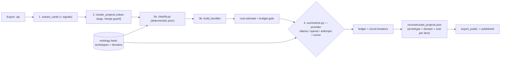

# chatgpt-extract

Turn a ChatGPT data export (`.zip`) into a structured, **ADOS-classified** catalog
of what you actually built and discussed — every item tagged with a **Primary
Archetype** (what kind of thing it is) and a **Primary Domain/Subdomain Pair**
(what knowledge governs it), instead of being forced into a one-size-fits-all
"software project" shape.

Deterministic stages do all the parsing/clustering with **zero LLM and zero
network**. The optional final stage uses an LLM (local Ollama by default, or
OpenAI / Anthropic / Cursor) only to classify and write prose — never to invent
facts.

> Run summaries, the run catalog, and cross-run stats live in the companion
> **private** repo `chatgpt-extract-catalog`.

## Pipeline



1. **extract_cards** (Stage 1) — stream the export, build a reduced transcript +
   a deterministic *card* per conversation (dates, version zips, file artifacts,
   and content **signals**). Junk "zips" (attachment hashes, bare `0.zip`) are
   dropped so they cannot pollute version counts.
2. **cluster_projects** (Stage 2) — union-find over real version-zip slugs. A
   `--merge-cap` guard stops a generic title slug from absorbing dozens of
   unrelated chats into a catch-all blob.
3. **classify** + **build_bundles** (Stage 3) — attach a deterministic
   archetype/domain *prior* to each cluster, then pack each cluster into one
   token-capped bundle.
4. **summarize** (Stage 4, optional LLM) — confirm/override the classification
   under ADOS drift guards and fill only the **archetype-conditioned** fields.
   Deterministic facts are merged *over* the model output.

## Quickstart

```bash
cp .env.example .env          # set VENV_DIR + RECONSTRUCTOR_DATA_ROOT
bash setup.sh                 # venv + ijson (+ jsonschema)

# Stages 1-3 (deterministic, no LLM):
./reconstruct run --zip "<your-export>.zip"

# Stage 4 with local Ollama (free):
./reconstruct summarize --provider ollama --model gpt-oss:20b

# ...or one shot, end-to-end:
./reconstruct all --zip "<your-export>.zip" --provider ollama --model gpt-oss:20b

# Publish a sanitized, PII-checked catalog:
python scripts/export_public.py --md --review
```

## LLM providers & cost control

Pick a provider with `--provider`; keys come from `.env`
(`OPENAI_API_KEY`, `ANTHROPIC_API_KEY`, `CURSOR_API_KEY`) and are never committed.

| Provider | Notes | Indicative cost for a full ~180-item run |
|---|---|---|
| `ollama` (default) | Local, `$0` marginal cost | ~$0.00 (electricity), ~1 hr+ |
| `openai` (`gpt-5-mini`) | Token-exact usage | ~$0.8 |
| `openai` (`gpt-5`) | Token-exact usage | ~$4.5 |
| `anthropic` (`claude-haiku-4`) | Token-exact usage | ~$2 |
| `anthropic` (`claude-sonnet-4`) | Token-exact usage | ~$7 |
| `cursor` | **Usage-based agent, not token-exact** — cost is an upper-bound estimate | — |

Cost is **estimated before any paid call** and printed; a paid run will not start
until you pass `--yes` (or `--dry-run` to only preview). Guards:

- `--max-usd N` — hard cap; the run aborts before the call that would exceed it.
- `--max-usd-per-item N` — per-item cap.
- Circuit breakers trip on consecutive failures, HTTP 429/5xx (with backoff), or
  budget breach; remaining items are marked `skipped_breaker` and partial results
  are written. Every call is traced to `summarize_trace.jsonl`.

Pricing lives in `config/pricing.json` (approximate, dated, editable). A
`--limit 5` test subset costs pennies on any cloud provider.

## Output schema & ontology

- **`schema/extracted_item_schema.json`** — internal items (with provenance).
- **`schema/extracted_item_public_schema.json`** — sanitized, GitHub-safe.
- **`ontology/`** — the ADOS **Reference Model Bank**: `archetypes.json`,
  `domains.json`, and the drift guards. See `ontology/README.md`.

Each item carries `primary_archetype`, `primary_domain_pair`, optional secondary
pairs, an ADOS `goal`, `objectives` (forming/speeding/governance), and
archetype-conditioned `archetype_fields` (e.g. a `software_app` has
quickstart/how_to_use/how_to_update; a `study_education_resource` has
audience/topics_covered; `media_generation` has subject/style).

## Privacy

Raw exports, transcripts, bundles, and `reconstructed_projects.json` are
gitignored. `export_public.py --review` strips conversation IDs and scans for
emails and personal paths before anything reaches `published/`.

## Tests

```bash
python -m pytest tests/ -q     # or: python -m unittest discover -s tests
```
