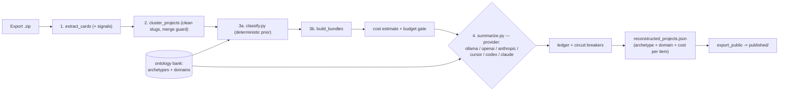
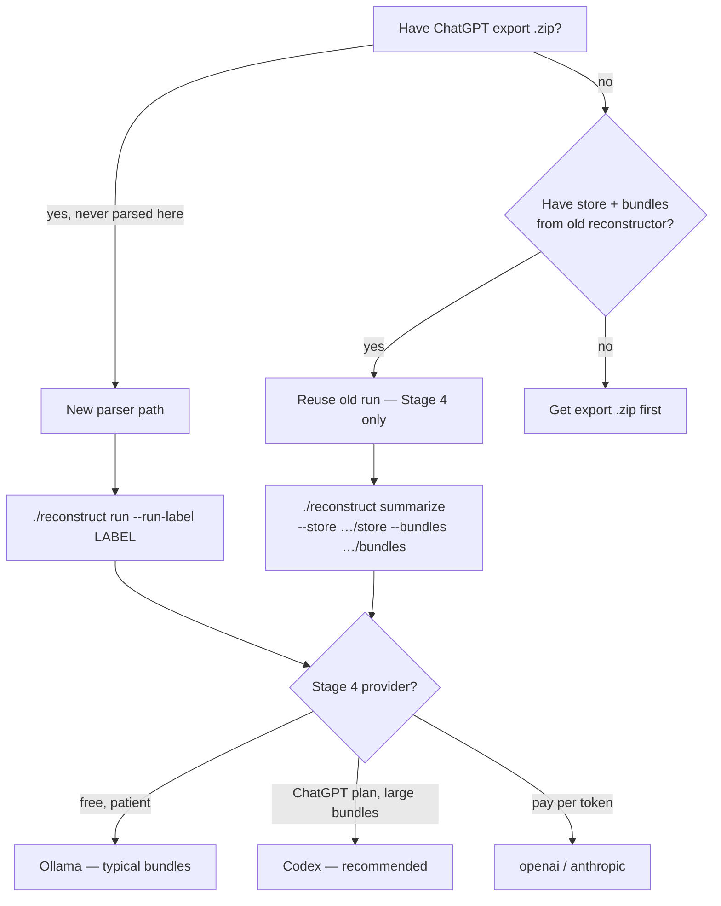

# chatgpt-extract

Turn a ChatGPT data export (`.zip`) into a structured, **ADOS-classified** catalog
of what you actually built and discussed — every item tagged with a **Primary
Archetype** (what kind of thing it is) and a **Primary Domain/Subdomain Pair**
(what knowledge governs it), instead of being forced into a one-size-fits-all
"software project" shape.

Deterministic stages do all the parsing/clustering with **zero LLM and zero
network**. The optional final stage uses an LLM (local Ollama by default,
subscription CLIs such as Codex, or pay-per-token OpenAI / Anthropic / Cursor)
only to classify and write prose — never to invent facts.

> Run summaries, the run catalog, and cross-run stats live in the companion
> **private** repo `chatgpt-extract-catalog`.

## Pipeline



1. **extract_cards** (Stage 1) — stream the export, build a reduced transcript +
   a deterministic *card* per conversation (dates, version zips, file artifacts,
   and content **signals**). Junk "zips" (attachment hashes, bare `0.zip`) are
   dropped so they cannot pollute version counts.
2. **cluster_projects** (Stage 2) — union-find over real version-zip slugs. A
   `--merge-cap` guard stops a generic title slug from absorbing dozens of
   unrelated chats into a catch-all blob.
3. **classify** + **build_bundles** (Stage 3) — attach a deterministic
   archetype/domain *prior* to each cluster, then pack each cluster into one
   token-capped bundle.
4. **summarize** (Stage 4, optional LLM) — confirm/override the classification
   under ADOS drift guards and fill only the **archetype-conditioned** fields.
   Deterministic facts are merged *over* the model output.

## Fast start

One-time setup, then parse your export and summarize a few items to prove the
pipeline works.

```bash
cp .env.example .env
bash setup.sh                              # Python venv + ijson + jsonschema

# Optional: Codex (ChatGPT plan) — install once, sign in once
curl -fsSL https://chatgpt.com/codex/install.sh | sh
codex login                                # "Sign in with ChatGPT", not API key
codex login status

# 1) Parse export — Stages 1–3, no LLM (~30–60 s on a 1.5 GB export)
./reconstruct run --zip "<your-export>.zip" --run-label my-run

# 2) Preview Stage 4 cost / item list (zero LLM calls)
./reconstruct summarize --provider codex --run-label my-run --limit 3 --dry-run

# 3) Summarize 3 items (draws on your ChatGPT/Codex plan quota)
./reconstruct summarize --provider codex --run-label my-run --limit 3
```

Output lands under `$RECONSTRUCTOR_DATA_ROOT/runs/<run-label>/` (from `.env`) or
`output/runs/<run-label>/` if `RECONSTRUCTOR_DATA_ROOT` is unset. Each run is
isolated: `store/`, `bundles/`, `reconstructed_projects.json`.

**Already have a full run from `chatgpt-project-reconstructor`?** Skip step 1 —
see [Reusing an old run](#reusing-an-old-run).

## How to use

### Which path am I on?



| Goal | What to run |
|---|---|
| First time on a new export | [New parser](#new-parser-fresh-export) → Stage 4 |
| Re-ADOS-ify an old `projects[]` JSON | [Reuse old run](#reusing-an-old-run) — keep store/bundles, re-summarize |
| Free local run | Ollama on new parser output; skip mega-clusters or use `--limit` |
| Best quality on huge items (`ados-profile`) | Codex (or API provider) |
| Publish sanitized catalog to GitHub | `python scripts/export_public.py --md --review` on **new-schema** JSON |

```bash
# After Stage 4 — input must be items[] (new schema), not legacy projects[]
python scripts/export_public.py \
  --in output/runs/my-run/reconstructed_projects.json \
  --md --review
```

### New parser (fresh export)

Use this when you have a ChatGPT export `.zip` that has **not** been parsed by
this package (v2.0+). Stages 1–3 are deterministic — no LLM, no network.

```bash
./reconstruct run --zip "<your-export>.zip" --run-label my-run-20260624
```

What the new parser adds over the legacy `chatgpt-project-reconstructor` run:

| Feature | Legacy run | New parser |
|---|---|---|
| Per-conversation `signals` | no | yes (content types, code/data/doc classes, …) |
| Cluster `signal_summary` | no | yes |
| Deterministic `classify_prior` | no | yes (Stage 3a) |
| Merge-cap on generic slugs | no | yes (fewer catch-all blobs) |
| Output schema | `projects[]` | `items[]` with ADOS archetypes/domains |

Check Stages 1–3 before spending LLM quota:

```bash
ls output/runs/my-run-20260624/store/     # index.json, cards.jsonl, clusters.json
ls output/runs/my-run-20260624/bundles/   # one .md per project cluster
```

Then Stage 4 — pick a provider (see [When to use Codex](#when-to-use-codex-and-why)):

```bash
# Local, $0 (good for small/medium bundles)
./reconstruct summarize --provider ollama --model qwen2.5-coder:14b \
  --run-label my-run-20260624 --limit 5 --num-ctx 16384

# ChatGPT plan (recommended for full catalog incl. large bundles)
./reconstruct summarize --provider codex --run-label my-run-20260624 --limit 5

# End-to-end in one command
./reconstruct all --zip "<export>.zip" --run-label my-run \
  --provider codex --limit 5
```

Isolate runs with `--run-label` so experiments do not overwrite each other.
Optional: set `default_zips` in `config/reconstruct.config.local.json` to omit
`--zip` on repeat runs.

> **Path note:** `./reconstruct` sources `.env`, which sets
> `RECONSTRUCTOR_DATA_ROOT` (default `~/chatgpt-reconstructor-data`). To write
> under the repo's `output/` instead, run `python run.py` / `python scripts/summarize.py`
> directly with `RECONSTRUCTOR_DATA_ROOT` unset, or point `.env` at the desired root.

### When to use Codex (and why)

**Codex** (`--provider codex`) shells out to the OpenAI Codex CLI (`codex exec`)
using your **ChatGPT subscription** session — not per-token API billing and not
Claude.

| Use Codex when… | Why |
|---|---|
| You already pay for ChatGPT Plus/Pro | Stage 4 draws on plan quota instead of API $ |
| You want ADOS classification on **large** bundles | Validated: `ados-profile` (~235 KB bundle) succeeds with Codex; local Ollama often returns empty/non-JSON on the same input |
| You are re-summarizing an **old run** into the new `items[]` schema | Store/bundles are reusable; Codex is the fastest path to a full catalog without re-parsing a 1.5 GB zip |
| You want reliable JSON on complex clusters | Codex consistently passes schema validation in smoke tests |

| Use Ollama instead when… | Why |
|---|---|
| Marginal cost must be $0 | Local inference, no quota meter |
| Bundles are small/medium | ~10–25 s/item on typical clusters; 5/6 smoke-test items passed with `qwen2.5-coder:14b` |
| You can skip or defer mega-clusters | `ados-profile`-scale items can fail locally — use `--limit` to batch smaller items first |

| Use API providers (`openai` / `anthropic`) when… | Why |
|---|---|
| You need token-exact cost accounting | `--max-usd` cap + ledger |
| No subscription CLI installed | Keys in `.env`; requires `--yes` after cost estimate |

**Codex setup** (once): install CLI → `codex login` (Sign in with ChatGPT) →
`codex login status`. Do **not** sign in with an API key if you want plan billing.
Details: [Installing subscription CLIs](#installing-subscription-clis-ubuntu--wsl).

Smoke-test results: [`docs/validation-smoke-20260624.md`](docs/validation-smoke-20260624.md).

### Reusing an old run

If you already ran the legacy `chatgpt-project-reconstructor` pipeline, you can
**reuse Stages 1–3** (store + bundles) and only re-run Stage 4 to produce the new
ADOS `items[]` JSON. You do **not** need to re-parse the export zip.

**What you can reuse**

| Artifact | Reusable? | Notes |
|---|---|---|
| `store/` (cards, clusters, transcripts) | yes | Old clusters lack `signal_summary`; priors are computed on the fly in Stage 4 |
| `bundles/*.md` | yes | Same 180 project bundles as a fresh parse of the same export |
| `reconstructed_projects.json` (`projects[]`) | reference only | Legacy schema — cannot `export_public.py` without re-summarizing |

**Typical old-run location** (example):

```
../chatgpt-project-reconstructor/output/runs/legacy-20260622/
├── store/
├── bundles/
└── reconstructed_projects.json   # old projects[] schema — keep for reference
```

**Option A — explicit paths** (no symlink; works from any data root):

```bash
OLD=../chatgpt-project-reconstructor/output/runs/legacy-20260622

# Preview (no LLM calls)
./reconstruct summarize --provider codex \
  --store "$OLD/store" --bundles "$OLD/bundles" \
  --out output/runs/codex-from-old/reconstructed_projects.json \
  --limit 3 --dry-run

# Re-summarize into ADOS schema (ChatGPT plan quota)
./reconstruct summarize --provider codex \
  --store "$OLD/store" --bundles "$OLD/bundles" \
  --out output/runs/codex-from-old/reconstructed_projects.json \
  --limit 12
```

Remove `--limit` for all ~180 items. Output is **new** `items[]` JSON; the old
`projects[]` file is left untouched.

**Option B — symlink into your data root** (then use `--run-label`):

```bash
mkdir -p ~/chatgpt-reconstructor-data/runs
ln -s ~/dev/ADOS/chatgpt-project-reconstructor/output/runs/legacy-20260622 \
      ~/chatgpt-reconstructor-data/runs/legacy-20260622

./reconstruct summarize --provider codex --run-label legacy-20260622 --limit 3
```

**When to re-parse anyway (new parser path):** you want `signal_summary` on
clusters, merge-cap improvements, or you have a **newer** export zip. A full
re-parse of the same zip takes ~30–60 s and is cheap compared to Stage 4.

## LLM providers & cost control

Pick a provider with `--provider`. There are two billing families:

- **API providers** (token-exact, pay-per-token): `openai`, `anthropic`. Keys
  come from `.env` (`OPENAI_API_KEY`, `ANTHROPIC_API_KEY`) and are never
  committed. These are billed separately and are **not** covered by ChatGPT or
  Claude subscriptions.
- **CLI / subscription providers** (billed against your signed-in plan/quota):
  `cursor`, `codex`, `claude`. These shell out to the locally-installed CLI, so
  Stage 4 draws on your existing plan instead of per-token API charges. See
  [Use your subscription plans](#use-your-subscription-plans).

| Provider | Billing | Notes |
|---|---|---|
| `ollama` (default) | Local | `$0` marginal cost, ~1 hr+ for ~180 items |
| `openai` (`gpt-5-mini`) | API, token-exact | ~$0.8 for a full ~180-item run |
| `openai` (`gpt-5`) | API, token-exact | ~$4.5 |
| `anthropic` (`claude-haiku-4`) | API, token-exact | ~$2 |
| `anthropic` (`claude-sonnet-4`) | API, token-exact | ~$7 |
| `cursor` | Cursor plan | Usage-based agent; Auto unlimited, frontier models draw the included pool |
| `codex` | ChatGPT plan | `codex exec`; quota-metered, not token-exact |
| `claude` | Claude plan | `claude -p`; draws the monthly Agent SDK credit pool (separate from chat) |

Cost is **estimated before any paid call** and printed; a paid run will not start
until you pass `--yes` (or `--dry-run` to only preview). Subscription providers
print "covered by your plan/quota" instead of a dollar figure. Guards:

- `--max-usd N` — hard cap; the run aborts before the call that would exceed it.
- `--max-usd-per-item N` — per-item cap.
- Circuit breakers trip on consecutive failures, HTTP 429/5xx (with backoff), or
  budget breach; remaining items are marked `skipped_breaker` and partial results
  are written. Every call is traced to `summarize_trace.jsonl`.

Pricing lives in `config/pricing.json` (approximate, dated, editable). A
`--limit 5` test subset costs pennies on any cloud provider.

## Installing subscription CLIs (Ubuntu / WSL)

`bash setup.sh` installs only the Python venv (`ijson`, `jsonschema`). The
subscription providers below are **separate** command-line tools that must be on
your `PATH` inside the shell where you run `./reconstruct` (for WSL, that means
inside WSL — not PowerShell on Windows).

Ensure `~/.local/bin` is on your PATH (add to `~/.bashrc` if needed):

```bash
echo 'export PATH="$HOME/.local/bin:$PATH"' >> ~/.bashrc
source ~/.bashrc
```

### Cursor Agent CLI (`--provider cursor`)

This pipeline shells out to **`cursor-agent`** (or `agent`), not the editor's
`cursor` command.

| What you have | What this package needs |
|---|---|
| Cursor desktop on Windows + WSL Remote | The IDE's `cursor` remote CLI (opens files/windows) — **not sufficient alone** |
| `cursor` on PATH in WSL | Same — editor helper, not the agent runtime |
| `cursor-agent` / `agent` on PATH | **This** — non-interactive agent used by Stage 4 |

If you use Cursor from Windows into WSL, you still need the **Agent CLI inside
WSL**. Two ways to get it:

```bash
# Option A — standalone installer (recommended)
curl https://cursor.com/install -fsS | bash

# Option B — lazy install: first run of `cursor agent` in WSL may download it
cursor agent --version
```

Verify: `cursor-agent --version` (or `agent --version`). If the binary lives
elsewhere, set `CURSOR_AGENT_BIN` in `.env` (see `.env.example`).

> The Cursor IDE, its extensions, and the Windows desktop app do **not** expose a
> programmatic agent session to this pipeline — only the WSL-local Agent CLI does.

### OpenAI Codex CLI (`--provider codex`)

```bash
curl -fsSL https://chatgpt.com/codex/install.sh | sh
# or, if you already use Node.js:  npm install -g @openai/codex
codex --version
```

Headless/WSL without a browser: `codex login --device-auth`.

### Claude Code CLI (`--provider claude`, optional)

Skip this if you are not using Claude yet.

```bash
curl -fsSL https://claude.ai/install.sh | bash
# or APT: see https://code.claude.com/docs/en/install
claude --version
```

## Use your subscription plans

If you already pay for ChatGPT, Claude, or Cursor, run Stage 4 on those plans
instead of per-token API rates. Install the matching CLI first (see
[Installing subscription CLIs](#installing-subscription-clis-ubuntu--wsl)), sign
in, then follow [When to use Codex](#when-to-use-codex-and-why) or the snippets
below. Start with `--limit 3`; use `--dry-run` to preview without spending quota.

**Cursor Pro** (`--provider cursor`):

```bash
agent login          # one-time browser sign-in
agent status         # confirm the right account + plan is active
./reconstruct summarize --provider cursor --model auto \
  --run-label legacy-eval --limit 3
```

Auto mode is unlimited on Pro; naming a frontier model (e.g. `--model sonnet-4.6`)
draws your included monthly pool.

**ChatGPT Pro** (`--provider codex`):

```bash
codex login          # choose "Sign in with ChatGPT" (NOT an API key)
codex login status
./reconstruct summarize --provider codex --run-label my-run --limit 3
```

For the full workflow (new export vs old run), see
[How to use](#how-to-use). Signing in with an API key switches Codex to API
pricing. Codex does **not** use Claude.

**Claude Pro** (`--provider claude`):

```bash
claude setup-token   # run on a machine with a browser; copy the token
# put it in .env:  CLAUDE_CODE_OAUTH_TOKEN="..."
unset ANTHROPIC_API_KEY   # the API key takes precedence and bills separately
./reconstruct summarize --provider claude \
  --run-label legacy-eval --limit 3
```

Note: as of 2026-06-15, headless `claude -p` usage draws a **separate monthly
Agent SDK credit pool**, distinct from your interactive chat limits. Confirm
actual usage on your Claude dashboard after a run.

Verify a provider without spending anything:

```bash
./reconstruct summarize --provider codex --run-label my-run --limit 3 --dry-run
```

## Output schema & ontology

- **`schema/extracted_item_schema.json`** — internal items (with provenance).
- **`schema/extracted_item_public_schema.json`** — sanitized, GitHub-safe.
- **`ontology/`** — the ADOS **Reference Model Bank**: `archetypes.json`,
  `domains.json`, and the drift guards. See `ontology/README.md`.

Each item carries `primary_archetype`, `primary_domain_pair`, optional secondary
pairs, an ADOS `goal`, `objectives` (forming/speeding/governance), and
archetype-conditioned `archetype_fields` (e.g. a `software_app` has
quickstart/how_to_use/how_to_update; a `study_education_resource` has
audience/topics_covered; `media_generation` has subject/style).

## Privacy

Raw exports, transcripts, bundles, and `reconstructed_projects.json` are
gitignored. `export_public.py --review` strips conversation IDs and scans for
emails and personal paths before anything reaches `published/`.

## Tests

```bash
python -m pytest tests/ -q     # or: python -m unittest discover -s tests
```
